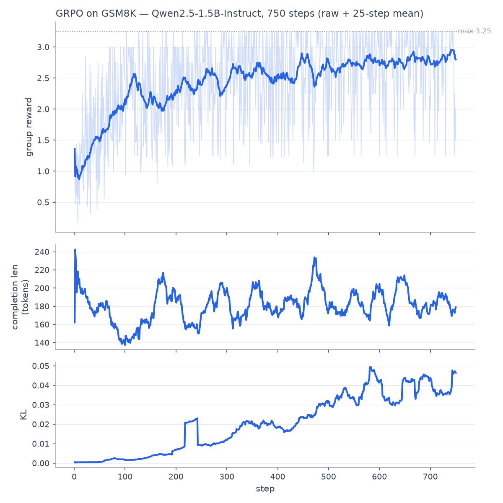

# Forge — teaching a 1.5B model to reason with RL, on one 8GB GPU

**Forge trains Qwen2.5-1.5B to solve math by reasoning — using GRPO (reinforcement
learning with verifiable rewards, the DeepSeek-R1 technique), not supervised
fine-tuning — on a single RTX 5060 (8GB).** It lifts GSM8K pass@1 from **58.8% →
70.0%** with no measured loss of general ability, then quantizes and serves the
result behind one interface with a hosted fallback.

## ▶ Live demo — [forge-grpo.vercel.app](https://forge-grpo.vercel.app)

The [**playground**](https://forge-grpo.vercel.app/playground) runs **real inference on a
live GPU**: type any grade-school math problem and watch the stock base model and the GRPO-tuned
adapter answer it side by side, streaming. Both are served from a single vLLM process via
multi-LoRA — the same 73MB adapter the training run produced, not a merged copy. It scales to
zero between visits, so the first request spends ~60–90s waking the container before tokens
start.

| page | what's there |
|---|---|
| [`/`](https://forge-grpo.vercel.app) | the headline result and a side-by-side sample |
| [`/playground`](https://forge-grpo.vercel.app/playground) | live base-vs-tuned inference on a problem you type |
| [`/method`](https://forge-grpo.vercel.app/method) | GRPO in plain terms, the reward stack, and the cold-start bug |
| [`/results`](https://forge-grpo.vercel.app/results) | every figure with the committed file it came from |
| [`/traces`](https://forge-grpo.vercel.app/traces) | full reasoning traces — including the problem both models miss |

> **RL across domains.** This is the LLM half of a pair: **PPO** for robotic
> manipulation (99% target-reach, TCS Medical Robotics) and **GRPO** for LLM
> reasoning (here). Same reinforcement-learning backbone, two very different
> action spaces — continuous robot control and discrete token generation.

## 10-second results (all measured, seed 3407)

| | base | Forge (GRPO) |
|---|---|---|
| **GSM8K pass@1** (1,319 held-out) | 58.8% | **70.0%** |
| ARC-Challenge (forgetting check) | 69.5% | 68.5% |

Trained in **86 min**, **3.64 GiB peak VRAM**. Reward **1.23 → 2.80** / 3.25.



## Why GRPO (and why it's the interesting part)

Supervised fine-tuning teaches a model to *imitate* answers. **GRPO teaches it to
*search*** — it samples 8 completions per problem, scores each with a verifiable
reward (is the final number correct? is it formatted?), and pushes probability
toward the better-than-average ones. No human labels, no reward model, no LLM judge
— just a math checker. That's what makes it a genuine reasoning-RL result rather
than a commodity fine-tune.

## Reward design — where the real work was

The reward functions *are* the training signal (`train/rewards.py`, max 3.25):
`correctness` +2.0, `format` +0.5, `numeric` +0.25, `tag_presence` +0.5 (graded).

**The bug worth reading about:** the first smoke run trained cleanly but every reward
was **0.0**. Qwen-1.5B ignored the format instruction, so no completion earned the
correctness or format reward — and with identical rewards in every group, GRPO's
advantage is zero and nothing learns. The model was getting the *math* right; it just
wouldn't use the tags. Two fixes: a **one-shot example** in the prompt, and a
**graded `tag_presence` reward** (+0.125 per tag) so partial compliance still creates
gradient. Rewards fired immediately after. This is the kind of failure GRPO is prone
to and catching it is the point.

## Architecture

```
data/     GSM8K pipeline, dataset-agnostic {prompt, answer} schema
train/    reward functions + GRPO trainer (Unsloth + TRL, vLLM rollouts)
eval/     pass@1, forgetting check, reward-curve plot (committed, seeded)
export/   merge LoRA → fp16 → GGUF f16/Q4_K_M  (quality-vs-latency table)
serve/    vLLM (fp16/GPU) + Ollama (Q4/GPU), provider-agnostic client w/ fallback
          modal_app.py — the scale-to-zero GPU endpoint behind the live playground
demo/     Next.js site (5 routes); gen_examples.py / gen_traces.py build its data
```

Stack: Qwen2.5-1.5B-Instruct · Unsloth 2026.7.3 · TRL 0.24 · vLLM 0.19.1 ·
torch 2.10+cu128 (Blackwell sm_120) · Python 3.11.

## Quickstart

```bash
# env: conda create -n forge python=3.11; pip install torch --index-url .../cu128
#      pip install unsloth vllm trl datasets transformers accelerate bitsandbytes
make test            # reward-function unit tests
make full-train      # GRPO, 750 steps × 8 gens  (~86 min, 3.64 GiB)
make eval            # base vs tuned pass@1 + ARC forgetting check
make export          # merge → GGUF f16 + Q4_K_M
make serve-vllm      # OpenAI endpoint on :8000   (or serve-ollama for Q4)
```

Then stream from whichever backend is up (falls back to a hosted endpoint if the
box is off — see `serve/README.md`):

```python
from serve.client import ForgeClient
for tok in ForgeClient().stream("What is 7 * 8?"):
    print(tok, end="", flush=True)
```

## Serving performance (RTX 5060, single stream)

| backend | TTFT | tok/s |
|---|---|---|
| vLLM fp16 (GPU) | 19 ms | 105 (674 batched) |
| Ollama Q4_K_M (GPU) | 139 ms | 228 |

## More
- **[MODEL_CARD.md](MODEL_CARD.md)** — full config, every measured number, limits.
- **[docs/sample_traces.md](docs/sample_traces.md)** — before/after reasoning traces.
- **[export/QUANT_DELTA.md](export/QUANT_DELTA.md)** — quantization quality/latency.
- **[serve/README.md](serve/README.md)** — serving + provider-agnostic client.

## Hardware honesty
8GB is the binding constraint and it's documented, not hidden: peak VRAM is reported
every phase, AWQ was deferred rather than risk the Blackwell stack, and Q4's ~7-point
quality cost is measured and stated. Numbers reproduce from committed scripts.
